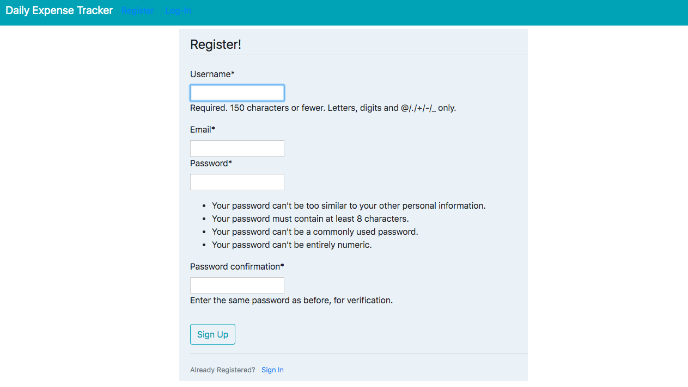
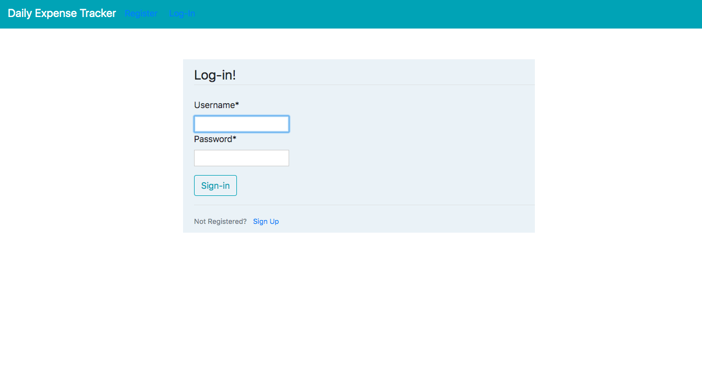
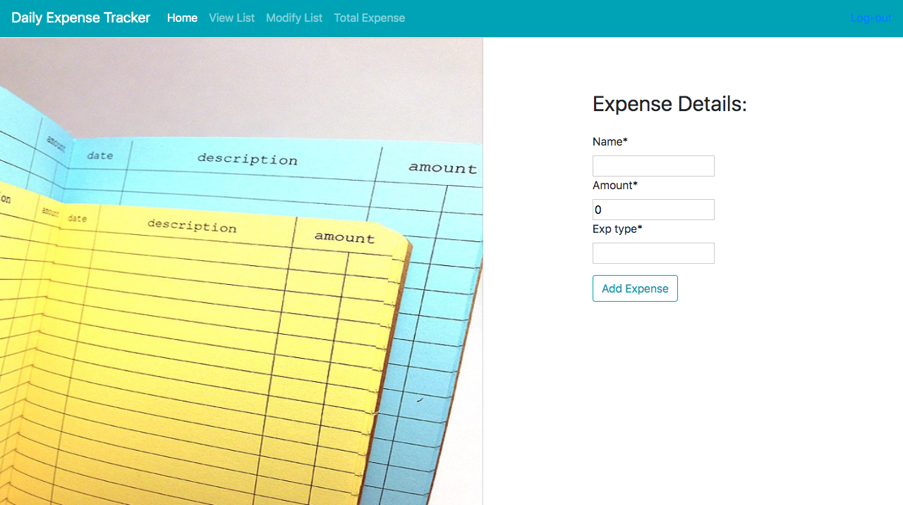
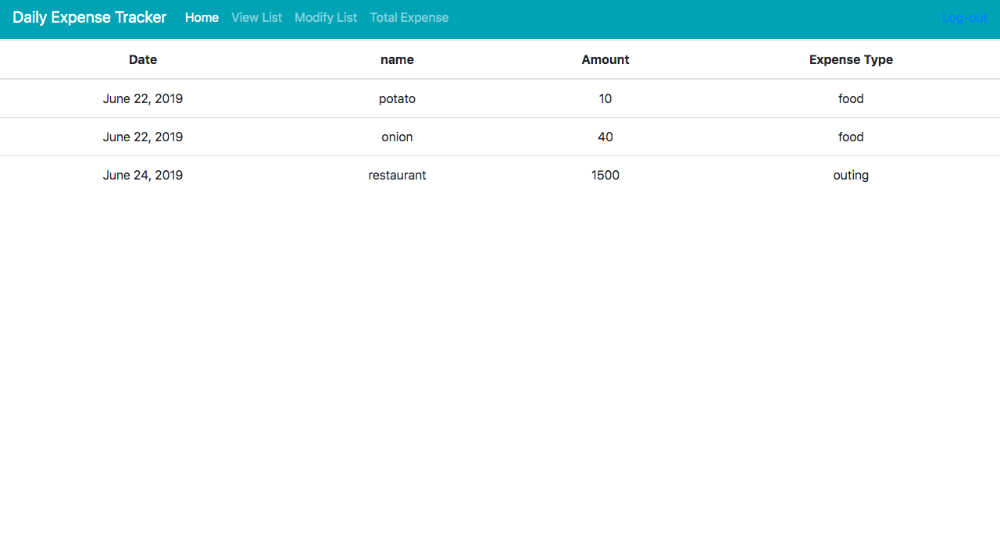
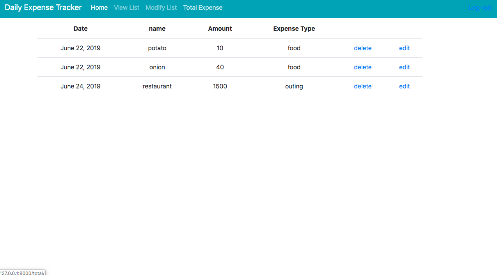

# DailyExpenseTracker

>This a django project which is used to manage the daily expenses of different users.Different users can register and create and account on this application and record their day-to-day expenses.The user can view , edit and delete their expenses as well.

### Getting Started

>mkdir djangoProject

>virtualenv det

>cd det

>git clone https://github.com/unnatii/DailyExpenseTracker.git

>source bin/activate

>sudo pip install django 

>pip install django-crispy-forms

>cd DailyExpenseTracker

>python manage.py migrate

>python manage.py runserver # starts the server 

-**Note: go to browser and open ' localhost:8000/Home '

>register your account

-**Note : for superuser :
>username= root , 
> password=rootpassword

### Prerequisites 
>django 1.11

>python 2.7.10

### Working

 
### Future work
>password reset via email

>filter list according to particular type , month , year or name

>deploy to linux server

>Custom Domain Name for Our Application

